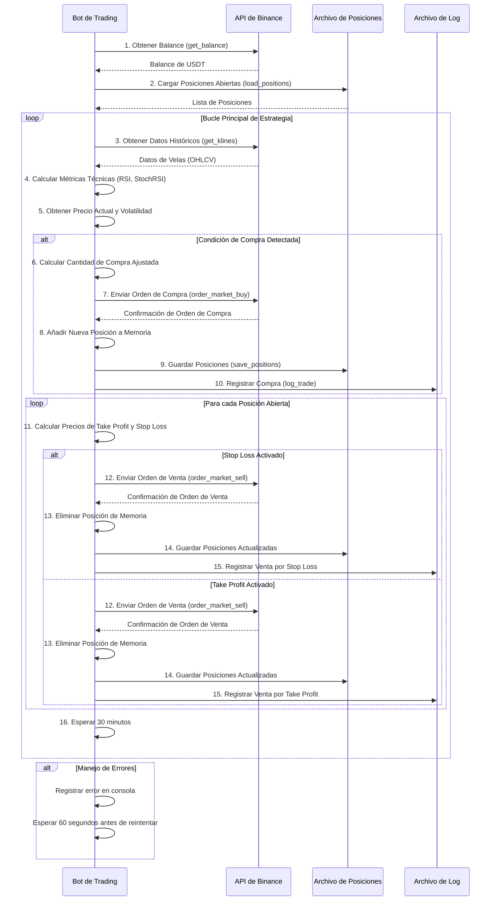

# Diagrama de Secuencia del Bot de Trading


## 1. Título del Proyecto

**Bot de Trading Automatizado para Binance Spot**

---

## 2. Descripción General

Este proyecto implementa un bot de trading automatizado en Python para operar criptomonedas (configurado para BTCUSDT o XRPUSDT) en la billetera spot de Binance. Utiliza indicadores técnicos como el RSI (Relative Strength Index) y el Stochastic RSI para identificar oportunidades de compra, y gestiona las posiciones abiertas con estrategias de Take Profit (TP) y Stop Loss (SL) para controlar el riesgo y asegurar ganancias. Todas las operaciones y eventos importantes se registran en un archivo CSV para auditoría y análisis futuro.

---

## 3. Características Principales

- **Conexión a Binance Testnet:** Opera inicialmente en el entorno de pruebas de Binance (Testnet) para simulación sin riesgo de capital real.
- **Gestión de Posiciones:** Carga y guarda el estado de las posiciones abiertas en un archivo CSV (`open_positions.csv`), permitiendo que el bot retome su operación incluso si se reinicia.
- **Análisis Técnico:** Calcula y utiliza el RSI y el Stochastic RSI para tomar decisiones de compra.
- **Gestión de Riesgos:** Implementa lógica de Take Profit (TP) y Stop Loss (SL) para cerrar operaciones automáticamente.
- **Registro de Operaciones:** Todas las compras y ventas, junto con métricas clave (precio, cantidad, ganancia, volatilidad, RSI, StochRSI), se registran en un archivo CSV (`trading_log.csv`).
- **Ajuste de Cantidad:** Asegura que las cantidades de las órdenes se ajusten al `step_size` mínimo permitido por Binance para el par de trading.
- **Bucle Continuo:** El bot opera en un bucle infinito, revisando las condiciones de mercado periódicamente (cada 30 minutos).

---

## 4. Requisitos Previos

- **Python 3.x**
- **Librerías Python:**
    - `python-binance`
    - `pandas`
    - `ta` (Technical Analysis library)
    - `python-dotenv`
    - `requests`
    - `os` (built-in)
    - `logging` (built-in)
    - `decimal` (built-in)
- **Cuenta de Binance:** Con credenciales de API (API Key y Secret Key) configuradas para Testnet.

> **Importante:** Por seguridad, no dejes tus API Keys directamente en el código fuente en un entorno de producción. Usa variables de entorno o un archivo de configuración seguro.

---

## 5. Configuración

El bot usa variables de entorno (idealmente desde un archivo `.env`) para credenciales y parámetros de estrategia.

### 5.1. Quickstart

1) Instala dependencias:

```bash
pip install -r requirements.txt
```

2) Crea tu `.env` usando `.env.example` como base.

3) Ejecuta:

```bash
python bot_trading_v2.py
```

Variables principales:

- `BINANCE_API_KEY` / `BINANCE_API_SECRET`: credenciales API.
- `BINANCE_TESTNET`: `true`/`false`.
- `SYMBOLS`: lista separada por comas (ej. `BTCUSDT,ETHUSDT`).
- `TIMEFRAME`: intervalo de velas (ej. `1h`).
- `POLL_INTERVAL_SECONDS`: frecuencia del loop de estrategia.
- `RSI_THRESHOLD`, `TAKE_PROFIT_PCT`, `STOP_LOSS_PCT`, `TRAILING_TAKE_PROFIT_PCT`, `TRAILING_STOP_PCT`, `POSITION_SIZE`.
- Telegram (opcional): `TELEGRAM_BOT_TOKEN`, `TELEGRAM_CHAT_ID`.

---

## 6. Archivos Generados

El bot crea archivos por símbolo dentro de la carpeta `./files`:

- `./files/trading_log_<SYMBOL>.csv`: operaciones (CSV estándar; si ya existía con `|`, mantiene ese delimitador por compatibilidad).
- `./files/open_positions_<SYMBOL>.csv`: posiciones abiertas por símbolo.

---

## 7. Lógica de Trading

### 7.1. Indicadores Técnicos

- **RSI (Relative Strength Index):** Calcula un valor entre 0 y 100 para determinar si un activo está sobrecomprado (normalmente > 70) o sobrevendido (normalmente < 30).
- **Stochastic RSI:** Un derivado del RSI que mide la posición del RSI actual en relación con su rango de precios durante un período de tiempo. Consiste en dos líneas, %K y %D, que se usan para identificar condiciones de sobrecompra/sobreventa y cruces alcistas/bajistas.

### 7.2. Estrategia de Compra

El bot buscará comprar bajo las siguientes condiciones:

- El RSI del activo es menor que `rsi_threshold` (por defecto 40), indicando una posible condición de sobreventa.
- La línea Stochastic RSI %K cruza por encima de la línea Stochastic RSI %D, lo que sugiere un cambio de impulso alcista.
- El balance disponible en USDT es suficiente para realizar la compra.

### 7.3. Estrategia de Venta

Para cada posición abierta, el bot monitorea el precio actual para dos condiciones de venta:

- **Take Profit (TP):** Si el precio actual alcanza o supera el precio de compra más el porcentaje `take_profit_pct` (por defecto 4%), la posición se cierra para asegurar ganancias.
- **Stop Loss (SL):** Si el precio actual cae al precio de compra menos el porcentaje `stop_loss_pct` (por defecto 10%), la posición se cierra para limitar las pérdidas.

---

## 8. Funciones Clave del Código

- `get_balance()`: Obtiene el balance libre de USDT de tu cuenta.
- `load_positions()`: Carga las posiciones abiertas desde el archivo CSV.
- `save_positions(positions)`: Guarda el estado actual de las posiciones en el archivo CSV.
- `get_data_binance()`: Recupera datos de velas (OHLCV) de Binance.
- `ajustar_cantidad(cantidad, step_size)`: Ajusta una cantidad de criptomoneda para que sea un múltiplo válido del `step_size` de Binance, usando Decimal para precisión.
- `cal_metrics_technig(df, rsi_w, sma_short_w, sma_long_w)`: Calcula el RSI, Stochastic RSI, SMA y MACD sobre los datos de las velas.
- `log_trade(...)`: Registra los detalles de una operación de compra o venta en el archivo de log.
- `run_strategy()`: La función principal que contiene el bucle de ejecución de la estrategia, orquestando todas las llamadas a funciones y la lógica de trading.

---

## 9. Flujo de Ejecución

1. El bot inicializa la conexión con Binance Testnet y configura los archivos de log y posiciones.
2. Carga el balance inicial y las posiciones abiertas previamente guardadas.
3. Entra en un bucle infinito:
        - Obtiene los datos de velas más recientes del par configurado.
        - Calcula los indicadores técnicos (RSI, Stochastic RSI) y la volatilidad.
        - Evalúa la condición de compra: Si el RSI es bajo y el Stochastic RSI indica un cruce alcista, y hay balance disponible, ejecuta una orden de compra, registra la operación y guarda la nueva posición.
        - Itera sobre todas las posiciones abiertas: Para cada una, verifica si se cumplen las condiciones de Take Profit o Stop Loss. Si alguna se activa, ejecuta una orden de venta, registra la operación y elimina la posición de la lista.
        - Espera un período de tiempo definido (30 minutos en este caso) antes de la siguiente iteración.
4. Incluye un manejo básico de excepciones para errores de conexión o API, reintentando después de un breve período de espera.

---

## 10. Consideraciones Importantes y Advertencias

- **¡Operar en Testnet es Fundamental!** Nunca despliegues un bot en un entorno de dinero real sin haberlo probado exhaustivamente en Testnet.
- **Gestión de `step_size`:** El `step_size` es crucial para que las órdenes se ejecuten correctamente. Binance tiene límites mínimos para la cantidad de criptomoneda que puedes comprar/vender. El valor de `step_size` debe corresponder al par que estás operando y es recomendable obtenerlo dinámicamente de la API de Binance (`client.get_symbol_info`) para asegurar que siempre sea correcto.
- **Latencia y Deslizamiento (Slippage):** Las órdenes de mercado (`order_market_buy/sell`) se ejecutan al mejor precio disponible en el momento. En mercados volátiles, el precio de ejecución puede ser diferente del precio al que se tomó la decisión.
- **Comisiones:** Las operaciones generan comisiones de Binance, las cuales no están explícitamente consideradas en los cálculos de ganancia mostrados en el log, pero sí afectan el balance real.
- **Volatilidad del Mercado:** Las estrategias basadas en indicadores pueden funcionar bien en ciertos mercados y fallar en otros. El bot no se adapta automáticamente a diferentes condiciones de mercado.
- **Conexión a Internet:** La estabilidad de la conexión es vital. Una desconexión puede llevar a que el bot pierda el estado o no ejecute órdenes críticas.
- **Riesgo de Pérdida:** El trading de criptomonedas es inherentemente riesgoso. Este bot es una herramienta, no una garantía de ganancias. Podrías perder todo tu capital invertido. No es asesoramiento financiero.

---

## 11. Mejoras Potenciales

- **Recuperación Dinámica de `step_size`:** Implementar una llamada a `client.get_symbol_info(symbol)` al inicio para obtener automáticamente el `step_size` y otros filtros de `lot_size`, `min_notional`, etc.
- **Manejo de Errores Robustos:** Mejorar el manejo de errores de la API de Binance (ej. `BinanceAPIException`), con reintentos estratégicos o notificaciones.
- **Configuración Externa:** Mover todos los parámetros de la estrategia a un archivo de configuración (ej. `config.ini`, `.env`, YAML) para facilitar la gestión y evitar hardcodear sensibles.
- **Más Indicadores:** Integrar otros indicadores técnicos (ej. Bandas de Bollinger, ADX, volumen) o patrones de velas para decisiones más complejas.
- **Backtesting:** Desarrollar una funcionalidad de backtesting para probar la estrategia con datos históricos y optimizar los parámetros antes de ir a Testnet.
- **Notificaciones:** Añadir notificaciones (Telegram, email, Discord) para eventos importantes como compras, ventas, errores o inicio/fin del bot.
- **Gestión de Múltiples Pares:** Extender el bot para operar con múltiples pares simultáneamente.
- **Capital de Reserva:** Implementar un límite de capital a usar o mantener un porcentaje del balance como reserva.
- **Horarios de Operación:** Definir horarios específicos en los que el bot debe operar.
---

## 12. Diagrama de secuencia

